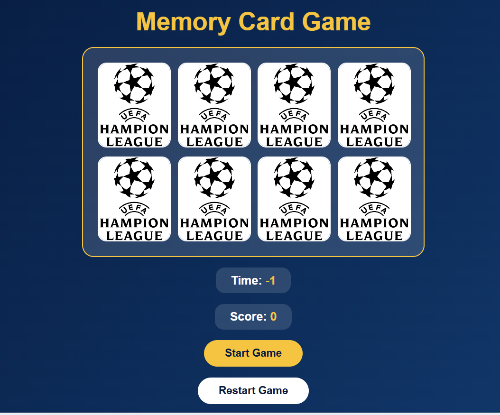

# 🃏 Memory Card Game

## Technologies Used

- HTML
- CSS
- JavaScript

## Description

Memory Card Game is a fun and interactive game where players flip over cards to find matching pairs. The goal is to match all pairs using the fewest moves and in the shortest amount of time. The game challenges players' memory, concentration, and observation skills while providing an enjoyable experience for all ages.

---

## User Stories

- As a user, I want to start a new game.
- As a user, I want to flip two cards at a time.
- As a user, I want matching cards to stay visible.
- As a user, I want non-matching cards to flip back over.
- As a user, I want to keep track of my moves.
- As a user, I want to complete the game by matching all card pairs.
- As a user, I want to restart the game and play again.

---

## Screenshots

---

## Future Enhancements

- Multiple difficulty levels (Easy, Medium, Hard)
- Timer and best score leaderboard
- Sound effects and card flip animations
- Different card themes (Animals, Food, Space, etc.)
- Multiplayer mode

---

## Credits

**Omar & Zaid**